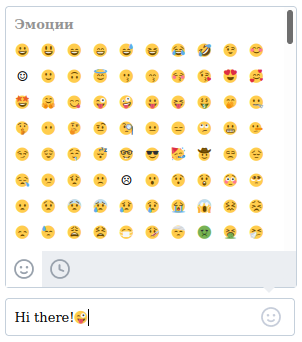

# Тестовое задание для стажёра в команду веб-мессенджера
### Emoji-picker Input

---
## Главная задача

- [x] Поле ввода должно изменять размер в зависимости от объёма введённого текста.

- [x] При нажатии на иконку справа должен открываться выпадающий интерфейс выбора эмодзи.

- [x] В интерфейсе выбора эмодзи внизу есть 2 иконки. Они переключают режим просмотра между всем списком и недавно использованными эмодзи (хранится 25 последних, есть версия, где хранятся частоиспользумые эмодзи).



---

## Дополнительная задача

> Находить и подсвечивать в поле ввода упоминания, хештеги, ссылки и адреса электронной почты

Добавил распознование ссылок, emails, хештегов при помощи regexp.
Распознование применится, если нажать ```ctrl + Enter```.
Подразумевается, что пользователь отправляет сообщение и оно больше не будет редактироваться.

## Другая информация

* В качестве фрейморка был использован React + Redux
* Эмодзи брались с [официальных ресурсов](https://github.com/Chaptykov/VKFrontendTask/blob/main/sections.json)
* Проект был загружен на GitHub Pages
